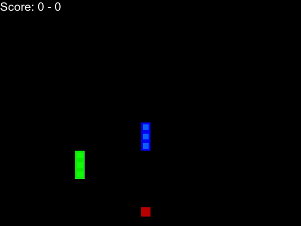

# Adversial Multi-Agent Training to Play Snake

Final project for the course Neural Networks and Deep Learning: From the Neuron to ChatGPT.

In this project, we trained two different models using reinforcement learning to teach AI to play Snake. The first snake was trained from scratch using a fully connected network (FCN). Then a second snake was trained separately from the first snake using a convolutional neural network (CNN) with transfer learning.

After both snakes performed well on their own, they were put into the same game to compete against each other, where their training kept on going. We argue, that this adversial approach gives a better understanding of how the models perform in a real-life scenario than just looking at their performance metrics.

This approach is applicable to models performing complex tasks, like playing a game in this example. By having a virtual ["gym"](https://github.com/openai/gym) different models can be tested in various scenarios to choose the most appropiate one for the task at hand.

## Snake Game

The game was based on [a tutorial](https://www.youtube.com/playlist?list=PLqnslRFeH2UrDh7vUmJ60YrmWd64mTTKV). It was further developed to remove borders, add more agents and have better plotting.

Furthermore, different network architectures were tested to pick the best models to put in the same game.



## Folder Structure

```
reinforcement-learning-game
├─ .gitignore
├─ game
│  ├─ agent.py --> Agent class for the snake trained with a fully-connected network
│  ├─ agent_multi.py --> Agent class for two snakes
│  ├─ arial.ttf
│  ├─ cnn_agent.py --> Agent class for the snake trained with a CNN
│  ├─ game.py --> Game class for one snake
│  ├─ game_multi.py --> Game class for two snakes
│  ├─ helper.py --> Plotting functions
│  ├─ model.py --> Script holding multiple network classes
│  └─ snake_game_human.py --> Snake game with manual control
├─ LICENSE
├─ model --> Folder to store different models
│  ├─ hybrid_model.pth
│  ├─ model_bound_73.pth
│  ├─ model_karahan_simple.pth
│  ├─ model_nobound_80.pth
│  ├─ model_nobound_85.pth
│  ├─ snake_1.pth
│  └─ snake_2.pth
└─ README.md
```
